# LENTERA: Offline AI Microserver for Remote & Rural Schools

> **LENTERA**: Bringing Light to the Most Unreachable Corners of the Earth.

## 🌏 Overview

LENTERA (meaning "light" in Bahasa Indonesia) is a lightweight, offline AI microserver powered by Gemma 3n, designed to empower underserved schools with advanced generative AI tools and educational content, without requiring internet access.

**Demo URL:** http://homelab.buddylabs.ai/ *(Note: Hosted on a personal homelab instance that may have limited availability)*

## ⚠️ The Problem: Internet & AI Divide in Education

While 2.2 billion children and young people worldwide lack internet at home, AI is rapidly transforming educational possibilities for those with access. On top of current "information divide", this situation also creates a devastating new "AI divide" where disconnected communities are doubly disadvantaged:

- No access to basic online resources
- No access to emerging AI educational tools
- Inability to develop AI literacy and skills

## 💡 LENTERA's Solution

LENTERA transforms any affordable computing device into a powerful educational AI hub by combining:

1. **On-device Gemma 3n model** (E2B quantized) for offline intelligence
2. **120GB+ educational content** from Wikipedia, LibreTexts, Khan Academy, and more
3. **AI learning toolkit**: semantic search, summaries, mindmaps, quizzes
4. **Local Wi-Fi hotspot** for multiple device connections
5. **Multilingual support** for inclusive education

All without requiring internet, subscriptions, or cloud services - at just 3.6-5.3% of conventional connectivity costs.

## 🔍 Key Features

- **Semantic Search**: Intelligent search that understands the intent behind queries in multiple languages
- **Article Summarization**: Creates concise summaries of educational content
- **FlashQuiz Generation**: Automatically generates quiz questions from materials
- **Mind Map Creation**: Produces visual knowledge maps for complex topics
- **ELIx**: Explains concepts at different age/education levels
- **Multilingual Interface**: Supports English, Bahasa Indonesia, and more

## 🏗 Technical Architecture

LENTERA uses a containerized microservices architecture:

```mermaid
flowchart LR
    User[User Devices<br>Laptop, Smartphone, Tablet]
    
    %% User connections to web services
    User -->|Wi-Fi : 8091| FE[Frontend<br/>Vite + React]
    User -->|Wi-Fi : 8080| WebUI[OpenWebUI]
    User -->|Wi-Fi : 8090| KiwixViewer[Kiwix Viewer<br/>Web Interface]
    
    %% Internal service connections
    FE -->|API : 3000| BE[Backend<br/>Hono + Bun]
    WebUI -->|Inference : 11434| Ollama[Ollama Service]
    BE -->|Inference : 11434| Ollama
    BE -->|Content : 8090| KiwixServer[Kiwix Server<br/>Content Service]
    BE -->|Data : 30000| DB[(LibSQL Database)]
    
    %% AI model connections
    Ollama -.-> Gemma[Gemma 3B]
    Ollama -.-> MiniLM[all-MiniLM-L12-v2]
    
    %% Storage connection
    KiwixServer -.-> ZIM[ZIM Files]
    DB -.-> DBFile[Database File<br/>.db]
    
    %% Viewer-Server connection
    KiwixViewer -->|Content Request| KiwixServer
    
    subgraph Server["🖥️ LENTERA Microserver"]
        direction TB
        
        subgraph WS["🌐 Web Services"]
            FE
            WebUI  
            KiwixViewer
        end
        
        subgraph CS["⚙️ Core Services"]
            BE
        end
        
        subgraph AI["🤖 AI Services"]
            Ollama
            Gemma
            MiniLM
        end
        
        subgraph ST["💾 Storage"]
            DB
            DBFile
            ZIM
            KiwixServer
        end
    end
    
    %% Styling
    classDef userNode fill:#e1f5fe,stroke:#01579b,stroke-width:2px
    classDef webService fill:#f3e5f5,stroke:#4a148c,stroke-width:2px
    classDef coreService fill:#e8f5e8,stroke:#1b5e20,stroke-width:2px
    classDef aiService fill:#fff3e0,stroke:#e65100,stroke-width:2px
    classDef storage fill:#fce4ec,stroke:#880e4f,stroke-width:2px
    
    class User userNode
    class FE,WebUI,KiwixViewer webService
    class BE coreService
    class Ollama,Gemma,MiniLM aiService
    class DB,ZIM,KiwixServer,DBFile storage
```



### How Gemma 3n Powers LENTERA

LENTERA leverages Gemma 3n's unique capabilities:

1. **On-device performance**: E2B quantized model runs efficiently on modest hardware
2. **Multilingual understanding**: Processes queries in multiple languages
3. **Structured output generation**: Creates quizzes, summaries, and mindmaps

## 🚀 Setup Instructions

### Hardware Requirements

- **Processor**: x86-64 architecture (Recommended: Ryzen 7 7840HS or similar)
- **Memory**: 16GB RAM minimum
- **Storage**: 128GB SSD storage for educational content
- **Network**: Wi-Fi adapter with hotspot capability

### Installation (Local Network)

1. Clone this repository:
   ```bash
   git clone https://github.com/fengkiej/lentera.git
   cd lentera
   ```

2. Download required ZIM files (educational content):
   ```bash
   mkdir -p lentera-zimfiles/data/zimfiles
   # Download ZIM files from https://download.kiwix.org/zim/other/
   # Place them in lentera-zimfiles/data/zimfiles/
   ```

3. Initialize the database and content:
   ```bash
   chmod +x ./db-init.sh && ./db-init.sh
   ```

4. Start the containers:
   ```bash
   SERVER_IP=0.0.0.0 docker-compose up -d
   ```

5. Access LENTERA:
   - Frontend: http://localhost:8091
   - Open WebUI: http://localhost:8080
   - Kiwix Web: http://localhost:8090

## 💰 Cost Efficiency

LENTERA delivers AI-powered education at a fraction of traditional connectivity costs:

| Metric | Traditional Connectivity | LENTERA | Cost Savings |
|--------|--------------------------|---------|--------------|
| Cost per school | $22,700 | $821-1,198 | 94.7-96.4% |
| Total for 86,000 schools | $1.95B | $70.6-103M | ~$1.85B |
| Percentage | 100% | 3.6-5.3% | ~95% |

## 🌟 Impact

LENTERA transforms educational possibilities for disconnected communities:

- **Immediate access** to AI-powered learning without infrastructure waiting time
- **Complete offline operation** in areas with no connectivity
- **Multilingual support** for inclusive education
- **Low-cost deployment** making it accessible for resource-constrained regions
- **No ongoing costs** after initial hardware investment

## 🧪 Current Limitations & Future Plans

- Content generation latency (30-90 seconds) mitigated by intelligent caching
- Limited i18n translation coverage for some regional languages
- Looking to add streaming responses, hardware acceleration, and local curriculum integration
